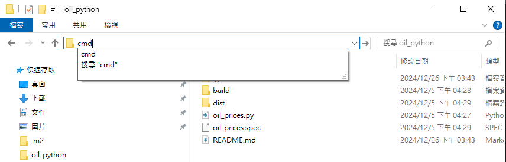
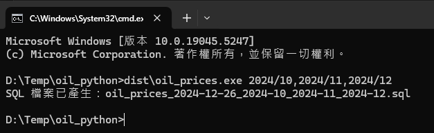

### How to use
- Step1. clone this project
- Step2. cd ${project_path}
- Step3. open cmd 
- Step4. excute `dist\oil_prices.exe ${your_time}` 

### Potential issues
- 目前data來源為: url = "https://vipmbr.cpc.com.tw/mbwebs/showhistoryprice_oil.aspx"
  - 如果中油更換網址或是格式變了 需要調整oil_prices.py內容